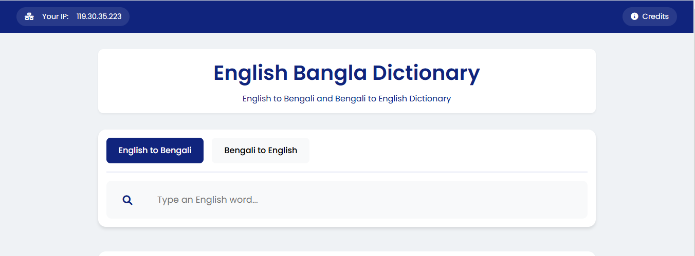

# English-Bengali Dictionary

A modern, responsive web-based dictionary application that provides seamless translation between English and Bengali languages. Built with Alpine.js for reactive UI components and featuring real-time search capabilities.



## [View Project](https://github.com/jeweltechie/english-to-bengali-dictionary)

## Features

- **Bi-directional Translation**
  - English to Bengali
  - Bengali to English
  - Real-time search results
  - Support for Bengali unicode characters

- **Modern User Interface**
  - Clean and responsive design
  - Instant search feedback
  - Mobile-friendly layout
  - Exact match highlighting

- **Search Features**
  - Starts-with search functionality
  - Multiple translations display
  - Parts of speech tagging
  - Up to 10 relevant results

- **Additional Features**
  - User IP tracking system
  - Responsive design for all devices
  - Clean and intuitive interface

## Technology Stack

- HTML5
- CSS3
- JavaScript
- [Alpine.js](https://alpinejs.dev/) - Lightweight JavaScript framework
- [Font Awesome](https://fontawesome.com/) - Icons
- [Google Fonts (Poppins)](https://fonts.google.com/specimen/Poppins) - Typography

## Database

The dictionary uses a JSON database structure:
```json
{
    "en": "word",
    "bn": "বাংলা অনুবাদ (parts of speech), অন্যান্য অনুবাদ"
}
```
## Installation

 **Clone the repository:**

 ```sh
git clone https://github.com/jeweltechie/english-to-bengali-dictionary.git
```

 **Navigate to the project directory:**
   ```sh
   
cd english-to-bengali-dictionary
```
## Usage

- **English to Bengali Search:**
  - Select "English to Bengali" tab
  - Type English word in the search box
  - Results appear automatically

- **Bengali to English Search:**
  - Select "Bengali to English" tab
  - Type Bengali word using unicode
  - View multiple English translations


